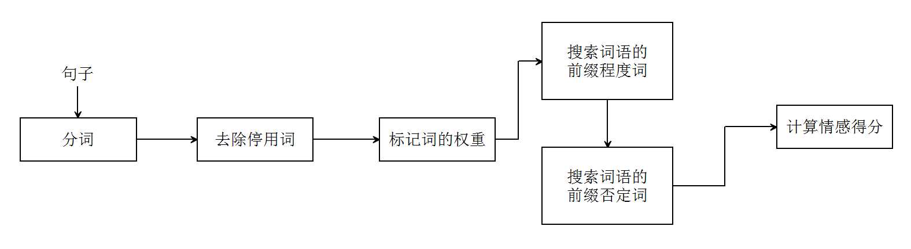
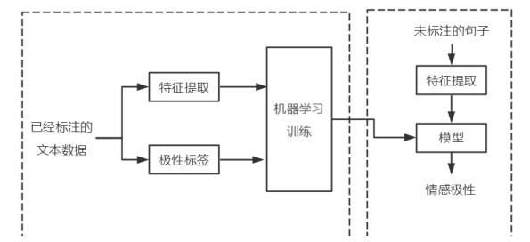
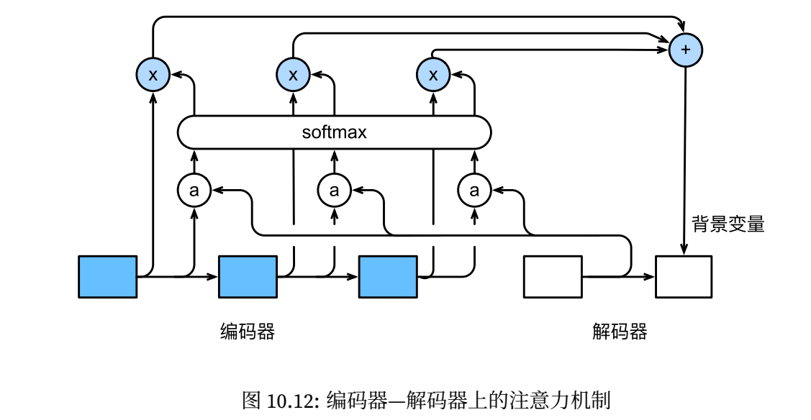
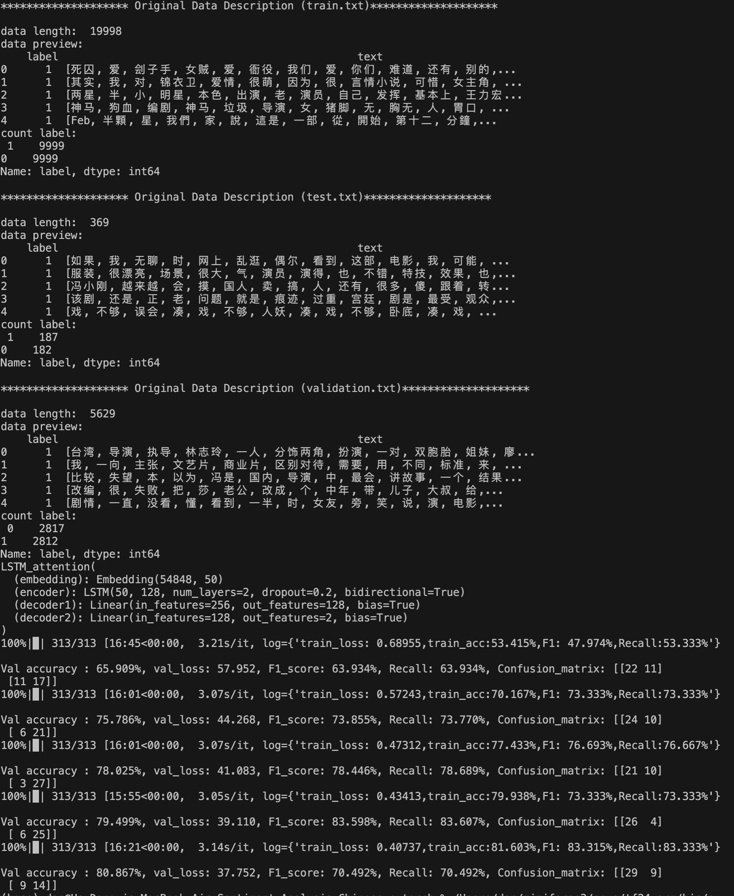
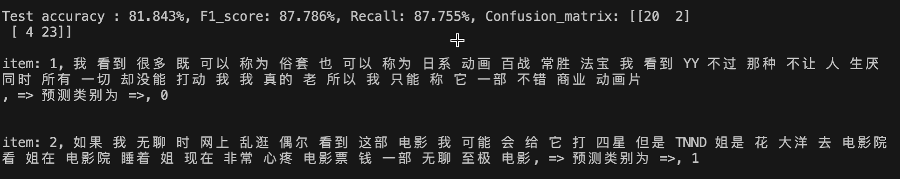

# 实现基于LSTM的情感分析

NLP中情感分析是一个比较常见的任务，涉及文本的情感特征提取、情感特征分类、情感特征检索与归纳等方面。

基于情感特征进行分类的方法主要有：

1.基于情感词典的方法

- 人工构建情感词典（人工总结标注）
- 自动构建情感词典（基于知识库）

2. 基于机器学习的方法

- 朴素贝叶斯
- SVM分类器
- 深度学习方法

## 1. 【情感分析】常用的数据集及开源库

以下是一些我们最常用的的用于试验情绪分析和机器学习方法的情绪分析数据集。 它们开源且可以免费下载 。

### 1.1 常用数据集

#### 1.1.1 亚马逊产品评价

产品评论：  此数据集包含数百万亚马逊客户评论，星级评级，对培训情绪分析模型非常有用。（https://www.kaggle.com/bittlingmayer/amazonreviews  ）

#### 1.1.2 Yelp餐饮评价

餐饮评论：此数据集包含5,2百万条评论星级的Yelp评论。（ https://www.kaggle.com/yelp-dataset/yelp-dataset）  

#### 1.1.3 电影评价

电影评论：此数据集包含1,000个正面和1,000个负面处理评论。 它还提供5,331个正面和5,331个负面处理句子/片段。（ http://www.cs.cornell.edu/people/pabo/movie-review-data/）  

#### 1.1.4 亚马逊食品评价

精美食品评论：此数据集包含来自亚马逊的约500,000份食品评论。 它包括产品和用户信息，评级以及每个评论的纯文本版本。（ https://www.kaggle.com/snap/amazon-fine-food-reviews）  

#### 1.1.5 航空公司Twitter评价

Kaggle上Twitter对航空公司的评论：该数据集包含约15,000条有关航空公司的标签推文（正面，中性和负面）。（ https://www.kaggle.com/crowdflower/twitter-airline-sentiment）  

#### 1.1.6 共和党辩论Twitter评价

第一次共和党辩论Twitter情绪：这个数据集由关于2016年第一次共和党辩论的大约14,000条标记的推文（正面，中立和负面）组成。（ https://www.kaggle.com/crowdflower/first-gop-debate-twitter-sentiment）  

### 1.2 开源库

- Sklearn
- jieba
- NLTK
- spacy

  

## 2. Seq2Seq模型

在Seq2Seq（Encoder-Decoder）模型中，Encoder编码器的作用是把一个不定长的输入序列$x_1,x_2,\dots,x_T$变换成一个定长的背景变量$c=q(h_1,h_2,\dots,h_T)$，并在该背景变量中编码输入序列$x_1,x_2,\dots,x_T$的信息。给定训练样本中的输出序列$y_1,y_2,\dots,y_{T'}$，对每个时间步$t'$，Decoder解码器输出$y_{t'}$的条件概率将基于之前输出序列$y_1,y_2,\dots,y_{t'}$和背景变量$c$，即$P(y_{t'}|y_1,y_2,\dots,y_{t'-1},c)$。

attention机制通过对Decoder编码器所有时间步的隐藏状态做加权平均来得到背景变量。Decoder在每一时间步调整这些权重，即注意力权重，从而能够在不同时间步分别关注输入序列中的不同部分并编码进相应时间步的背景变量。

加入attention机制后，Decoder每一时间步可以使用可变的背景变量$c_{t'}$。Encoder在时间步$t$的隐藏状态为$h_t$，且总时间步数为$T$，Decoder在时间步$t'$的背景变量为所有Encoder隐藏状态的加权平均：
$$
c_{t'}=\sum_{t=1}^{T}\alpha_{t't}h_t
$$
给定$t'$，权重$\alpha_{t't}$在$t=1,\dots,T$的值是一个概率分布。为了得到概率分布，可以使用softmax运算：
$$
\alpha_{t't}=\frac{exp(e_{t't})}{\sum_{k=1}^{T}exp(e_{t'k})},t=1,\dots,T
$$
现在，我们需要定义如何计算上式中softmax运算的输入$e_{t't}$，由于$e_{t't}$同时取决于Decoder的时间步$t'$和Encoder的时间步$t$，不妨以Decoder在时间步$t'-1$的隐藏状态$s_{t'-1}$与Encoder在时间步$t$的隐藏状态$h_{t}$为输入，并通过函数a计算$e_{t't}$：
$$
e_{t't}=a(s_{t'-1},h_t)
$$
函数a有多种选择，如果两个输入向量长度相等，可以取內积$a(s,h)=s^Th$。而最早提出注意力机制的论文则将输入连结后通过含单隐藏层的多层感知机变换：
$$
a(s,h)=v^Ttanh(W_ss+W_hh)
$$
  其中$v$、$W_s$、$W_h$都是可以学习的模型参数。

## 3. 【情感分析】一个简单例子

这里会给一个**情感分类**的例子，使用的是**BiLSTM+Attention**的Seq2Seq模型。

利用深度学习来解决情感分类问题，最重要的是考虑如何语义表征/如何融合信息，至于分类，其实很简单，一个线性层即可。

### 3.1 评价指标

- Accuracy=(TP + TN) / (TP + FN + FP + FN)
- Precision=TP /( TP + FP)
- Recall=TP / (TP + FN)
- F1=2 * Recall * Precision / (Recall + Precision)

### 3.2 实现Bi-LSTM+Attention  

Pipeline流程：

1. 拿到文本，分词，清洗数据(去掉停用词语）
2. 建立word2index， index2word 表
3. 准备好预训练好的 word embedding ( or start from one hot)
4. 做好 Dataset / Dataloader，得到数据集的句子表示
5. 建立模型. (soft attention. / hard attention/ self-attention/ scaled dot
   product self attention)  
6. 配置好参数  
7. 开始训练  
8. 测评  
9. 保存模型

注意：model保存为state_dict形式更好，重载model框架以及存在state_dict里的参数更稳定，不受pytorch和其他package的版本影响。

关于数据：

- data文件夹：存放停用词，训练数据集、测试数据集、验证数据集。文本的数据集是由已分词的影评文本，以及对应的标签（2类，0表示正面评价，1表示负面评价）组成。其中，训练集含19998条评价（正面、负面评价各占一半）；测试集含369条评价（正面评价：182，负面评价：187）；验证集含5629条评价（正面评价：2817，负面评价：2812）。数据很平衡，故不用进行不平衡处理。
- model文件夹：存放训练好的模型。
- word2vec文件夹：存放预训练中文词向量（wiki_word2vec_50.bin），word2id词表，语料的词向量表示等。
- paper文件夹：引入注意力机制的双向LSTM的文本分类论文。
- images文件夹：README.md用到的一些图片。

关于代码：

- **Sentiment_Analysis_Config.py**：配置数据处理、模型构建的参数等；
- **Sentiment_Analysis_DataProcess.py**：读取数据集、构建word2id表、构建语料的word2vec词向量表示、获得文本句子和标签的的数字索引表示。
- **Sentiment_model.py**：模型有2个：一个是普通的LSTM，一个是多层LSTM堆叠并引入attention机制的BiLSTM+Attention模型。
- **Sentiment_Analysis_eval.py**：根据训练好的模型对测试集进行预测，由准确率、F1、Recall、混淆矩阵来评估模型性能。
- **Sentiment_Analysis_main.py**：基于BiLSTM+Attention模型的情感分析全流程。

关于运行：

1. 在**Sentiment_Analysis_Config.py**中配置相关参数；
2. 运行**Sentiment_Analysis_DataProcess.py**生成相应的word2id，word2vec等文件；
3. 运行主函数**Sentiment_Analysis_main.py**，得到训练好的模型，并保存模型；
4. 运行**Sentiment_Analysis_eval.py**，读取模型，对给定的测试文本（pre.txt）给出评价。

运行示例：

Sentiment_Analysis_main.py运行效果：

Sentiment_Analysis_eval.py运行效果：

## 4. Reference

- 文本情感分析方法小结 LeonG （ https://zhuanlan.zhihu.com/p/106588589）  

- Chineses-Sentiment Analysis-Pytorch ：李狗嗨
  (https://github.com/Ligouhai-bigone/Sentiment-Analysis-Chinese-pytorch)  

- Recall . Precision
  (https://www.zhihu.com/question/19645541/answer/91694636)  

- Bilstm+attention(https://www.cnblogs.com/jiangxinyang/p/10208227.html)  

- Lstm (https://zybuluo.com/hanbingtao/note/581764)  

  

